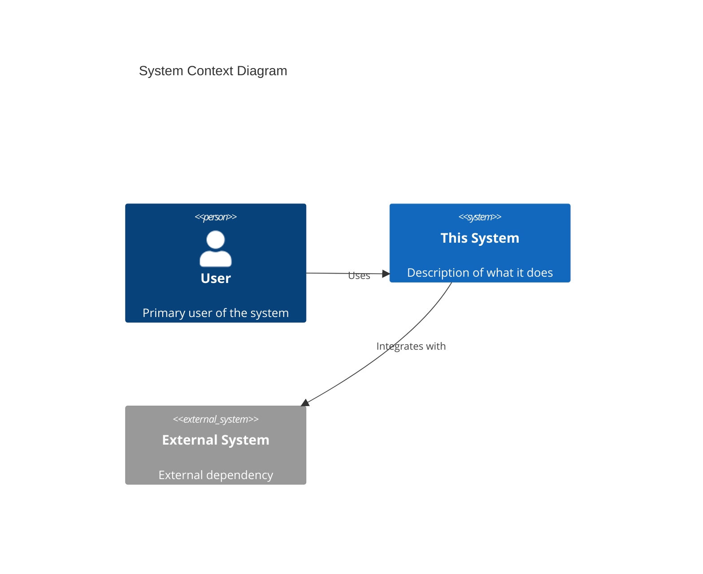
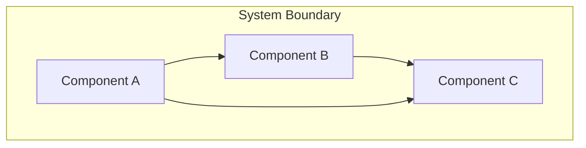
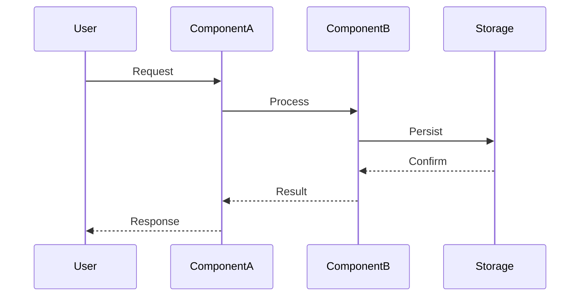
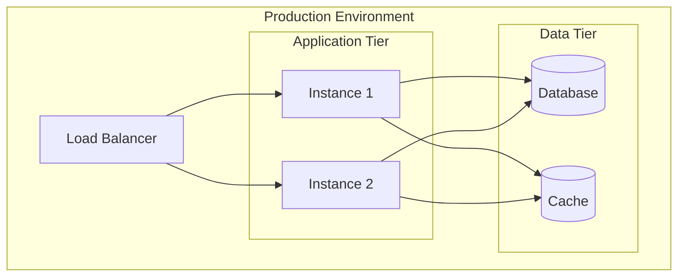

# Architecture

> **This document owns**: System design, component architecture, data flow, design patterns, ADRs, and cross-cutting concerns (error handling, logging, security patterns).
> **Related**: [tech.md](./tech.md) for technology choices, [structure.md](./structure.md) for code organization, [conventions.md](./conventions.md) for coding style.

## Overview
[High-level description of the system architecture. What does this system do and how is it organized?]

## System Context
[Describe how this system fits into the larger ecosystem. What are the external systems, users, and boundaries?]

## Component Architecture

### Core Components
[List and describe the major components/modules of the system]

| Component | Responsibility | Key Interfaces |
|-----------|---------------|----------------|
| [Component 1] | [What it does] | [APIs, events, data it exposes] |
| [Component 2] | [What it does] | [APIs, events, data it exposes] |

### Component Diagram

## Data Flow

### Primary Data Flows
[Describe how data moves through the system for key operations]

### Data Models

> **See**: [structure.md](./structure.md) for file/module organization of data models. This section covers data relationships and schema design.

[Key data structures and their relationships]

## Design Patterns

### Patterns in Use
[Document the design patterns employed and why]

| Pattern | Where Used | Rationale |
|---------|-----------|-----------|
| [e.g., Repository] | [Data layer] | [Abstracts data access, enables testing] |
| [e.g., Observer] | [Event system] | [Decouples components, enables extensibility] |
| [e.g., Factory] | [Object creation] | [Centralizes construction logic] |

### Pattern Implementations
[Brief description of how each pattern is implemented in this codebase]

## Architecture Decision Records (ADRs)

### ADR-001: [Decision Title]
- **Status**: [Proposed | Accepted | Deprecated | Superseded]
- **Context**: [What is the issue or situation that requires a decision?]
- **Decision**: [What is the decision that was made?]
- **Consequences**: [What are the positive and negative consequences?]
- **Alternatives Considered**: [What other options were evaluated?]

### ADR-002: [Decision Title]
- **Status**: [Proposed | Accepted | Deprecated | Superseded]
- **Context**: [Description]
- **Decision**: [Description]
- **Consequences**: [Description]
- **Alternatives Considered**: [Description]

## Cross-Cutting Concerns

> **Note**: This section defines architectural patterns for cross-cutting concerns. See [conventions.md](./conventions.md) for coding style (how to format error messages, log statements).

### Error Handling
[How errors are handled, propagated, and reported across the system]

### Logging & Observability
[Logging strategy, log levels, structured logging, metrics, tracing]

### Security

> **See**: [tech.md](./tech.md) for security requirements and compliance standards. This section covers security implementation patterns.

[Authentication, authorization, data protection, secure communication]

### Configuration
[How configuration is managed, environment-specific settings, secrets]

## Scalability Considerations
[How the architecture supports scaling - horizontal, vertical, caching, etc.]

## Integration Points

### External APIs
| API | Purpose | Protocol | Authentication |
|-----|---------|----------|----------------|
| [API 1] | [What it's used for] | [REST/gRPC/etc] | [Auth method] |

### Events/Messages
| Event | Publisher | Subscribers | Purpose |
|-------|-----------|-------------|---------|
| [Event 1] | [Component] | [Components] | [Why] |

## Deployment Architecture
[How the system is deployed - containers, VMs, serverless, on-premise, etc.]

## Evolution & Roadmap
[How the architecture is expected to evolve, known areas for improvement]

### Technical Debt
- [Debt item 1]: [Impact, plan to address]
- [Debt item 2]: [Impact, plan to address]

### Future Considerations
- [Future enhancement 1]: [Why and when it might be needed]
- [Future enhancement 2]: [Why and when it might be needed]
