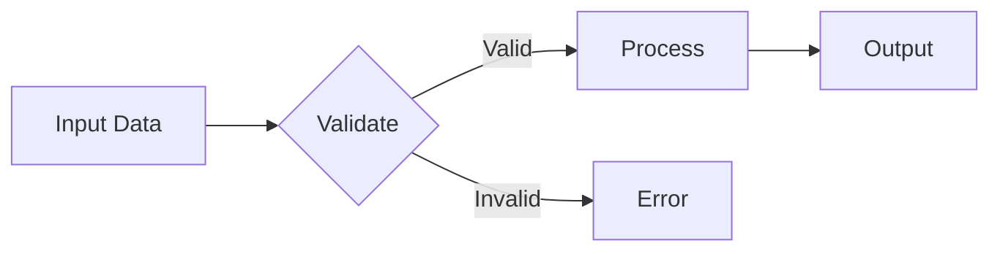

# Documentation Strategy

> **This document owns**: Documentation locations, format standards, visual documentation, validation cases, and doc generation tools.
> **Related**: [conventions.md](./conventions.md) for code comment style, [structure.md](./structure.md) for where docs live in the project.

## Overview
[Describe the documentation philosophy for this project. What role does documentation play in the project's success? Who are the audiences?]

## Documentation Locations

### Primary Locations
| Type | Location | Purpose |
|------|----------|---------|
| API Reference | [e.g., `/docs/api/`] | Generated API documentation |
| User Guide | [e.g., `/docs/user-guide/`] | End-user instructions |
| Developer Docs | [e.g., `/docs/dev/`] | Contributor documentation |
| Inline Docs | [e.g., Source files] | Code-level documentation |
| README | [e.g., Root directory] | Project overview and quick start |

### External Documentation
- [e.g., Wiki, Confluence, Notion pages]
- [e.g., Published documentation site]

## Target Audiences

### Audience Matrix
| Audience | Needs | Primary Docs |
|----------|-------|--------------|
| End Users | How to use the software | User Guide, Tutorials |
| Developers | How to contribute, API details | Dev Docs, API Reference |
| Scientists/Engineers | Mathematical foundations, validation | Theory Docs, Validation Cases |
| Operations | Deployment, monitoring | Ops Guide, Runbooks |

## Format Standards

### Markup Language
| Option | When to Use | Tools |
|--------|-------------|-------|
| Markdown | Simple docs, READMEs | Any editor |
| MyST Markdown | Sphinx with extended features | myst_parser |
| reStructuredText | Traditional Sphinx | Sphinx core |
| Docstrings | In-code API docs | autodoc, pdoc |

### Markdown Conventions
- Use ATX-style headers (`#`, `##`, `###`)
- Code blocks with language identifiers
- Tables for structured data
- Relative links for internal references
- Footnotes for definitions: `[^term]: Definition here`

### Code Examples
[Standards for code examples in documentation]

```python
# Example: Code blocks should be complete and runnable
def example_function(param: float) -> float:
    """
    Brief description of what this does.

    Args:
        param: Description of parameter

    Returns:
        Description of return value
    """
    return param * 2.0
```

### Mathematical Derivations

#### LaTeX/KaTeX Notation
Use LaTeX notation for mathematical expressions:

Inline math: `$E = mc^2$`

Block math:
```
$$
\frac{\partial u}{\partial t} = \alpha \nabla^2 u
$$
```

#### Derivation Structure (for technical/scientific projects)
1. **Statement**: What we're deriving
2. **Assumptions**: Starting conditions
3. **Steps**: Numbered derivation steps with explanations
4. **Result**: Final equation with interpretation
5. **Validation**: How to verify correctness

#### Custom Math Macros (Sphinx/MathJax)
For projects with repeated mathematical notation, define macros in `conf.py`:
```python
mathjax3_config = {
    "tex": {
        "macros": {
            "RR": r"\mathbb{R}",
            "boldx": r"\mathbf{x}",
        }
    }
}
```

#### Example Derivation Format
```markdown
### Snell's Law Derivation

**Goal**: Derive the relationship between incident and refracted angles.

**Assumptions**:
- Planar interface between two media
- Monochromatic light

**Derivation**:

1. Starting from Fermat's principle of least time:
   $$t = \frac{d_1}{v_1} + \frac{d_2}{v_2}$$

2. Minimizing with respect to position:
   $$\frac{dt}{dx} = 0$$

3. After differentiation:
   $$\frac{\sin\theta_1}{v_1} = \frac{\sin\theta_2}{v_2}$$

4. Using $n = c/v$:
   $$n_1 \sin\theta_1 = n_2 \sin\theta_2$$

**Result**: Snell's Law relates angles to refractive indices.
```

## Visual Documentation

### ASCII Diagrams
Use ASCII art for simple diagrams that render everywhere:

```
    Light Source
         |
         v
    +---------+
    |  Lens   |
    +---------+
         |
         v
    [  Sensor  ]
```

### Mermaid Flowcharts
Use Mermaid for process flows and architecture:



### Sample Images

#### Matplotlib/Plotly Conventions
| Aspect | Standard |
|--------|----------|
| Figure size | [e.g., 10x6 inches for full-width] |
| DPI | [e.g., 150 for docs, 300 for publication] |
| Color scheme | [e.g., viridis, project-specific palette] |
| Font size | [e.g., 12pt labels, 14pt titles] |
| File format | [e.g., PNG for raster, SVG for vector] |

#### Example Plot Generation
```python
import matplotlib.pyplot as plt
import numpy as np

def create_documentation_figure():
    """Generate a figure following documentation standards."""
    fig, ax = plt.subplots(figsize=(10, 6), dpi=150)

    x = np.linspace(0, 10, 100)
    ax.plot(x, np.sin(x), label='sin(x)')

    ax.set_xlabel('X Axis Label', fontsize=12)
    ax.set_ylabel('Y Axis Label', fontsize=12)
    ax.set_title('Figure Title', fontsize=14)
    ax.legend()
    ax.grid(True, alpha=0.3)

    fig.savefig('docs/images/example.png',
                bbox_inches='tight',
                facecolor='white')
    return fig
```

#### Image Storage
- Location: `docs/images/` or `assets/`
- Naming: `[topic]-[description]-[version].png`
- Alt text: Always provide descriptive alt text

### Interactive Visualizations (Plotly)
```python
import plotly.graph_objects as go

def create_interactive_figure():
    """Generate an interactive Plotly figure."""
    fig = go.Figure()
    fig.add_trace(go.Scatter(
        x=[1, 2, 3, 4],
        y=[10, 11, 12, 13],
        mode='lines+markers',
        name='Sample Data'
    ))
    fig.update_layout(
        title='Interactive Plot',
        xaxis_title='X Axis',
        yaxis_title='Y Axis'
    )
    # Export as HTML for embedding in docs
    fig.write_html('docs/interactive/plot.html')
    return fig
```

## Validation Cases

### Purpose
Validation cases demonstrate that the software works as intended. This goes beyond unit tests to provide evidence that the system correctly solves the problems it claims to solve.

### Types of Validation

| Type | Purpose | Example |
|------|---------|---------|
| **Analytical** | Compare against mathematical/closed-form solutions | Physics formulas, algorithm proofs |
| **Reference** | Compare against published results or standards | RFC compliance, benchmark datasets |
| **Cross-implementation** | Compare multiple backends produce same results | CPU vs GPU, different libraries |
| **Golden file** | Compare output against known-good snapshots | Compiler output, report generation |
| **Integration** | Verify correct behavior with real external systems | API responses, database queries |
| **Behavioral** | Verify user-facing workflows produce expected outcomes | E2E tests, user acceptance tests |

### Validation Case Structure
```markdown
## Validation Case: [Name]

### What This Validates
[The specific claim or behavior being verified]

### Evidence Source
[Where expected results come from - could be any of:]
- Analytical solution or derivation
- Published paper, RFC, or specification
- Reference implementation
- Real-world test data
- Expert review

### Setup
- Inputs: [Data, configuration, environment]
- Preconditions: [Required state]

### Expected vs Actual
| Aspect | Expected | Actual | Pass? |
|--------|----------|--------|-------|
| [Output/behavior] | [Value] | [Measured] | ✓/✗ |

### Pass Criteria
[How to determine success - could be:]
- Exact match
- Within tolerance (±X%)
- Behavioral equivalence
- No error/exception
```

### Validation Categories
| Category | Purpose | Frequency |
|----------|---------|-----------|
| Unit Validation | Individual function correctness | Every build |
| Integration Validation | Component interaction | Daily/PR |
| Reference Validation | Against authoritative sources | Release |
| Regression Validation | No degradation from changes | Every PR |
| Acceptance Validation | User-facing requirements met | Release |

## Documentation Generation

### Tools
| Tool | Purpose | Configuration |
|------|---------|---------------|
| [e.g., Sphinx] | API docs generation | `docs/conf.py` |
| [e.g., MkDocs] | User documentation | `mkdocs.yml` |
| [e.g., pdoc] | Python docstrings | CLI options |

### Build Commands
```bash
# Generate API documentation
[command to generate API docs]

# Build user documentation
[command to build user docs]

# Serve locally for preview
[command to serve docs locally]
```

### Automation
- [e.g., Docs built on every PR]
- [e.g., Published on release]
- [e.g., Link checking in CI]

## Maintenance

### Review Cadence
| Doc Type | Review Frequency | Owner |
|----------|-----------------|-------|
| API Reference | Every release | Dev team |
| User Guide | Quarterly | Product team |
| Validation Cases | Every major change | Science team |

### Versioning
- [e.g., Docs versioned with software]
- [e.g., Previous versions accessible]
- [e.g., Migration guides for breaking changes]

### Quality Checks
- [ ] All code examples tested and runnable
- [ ] Mathematical notation renders correctly
- [ ] Images have alt text
- [ ] Links are valid
- [ ] Validation cases pass
- [ ] No stale/outdated content
